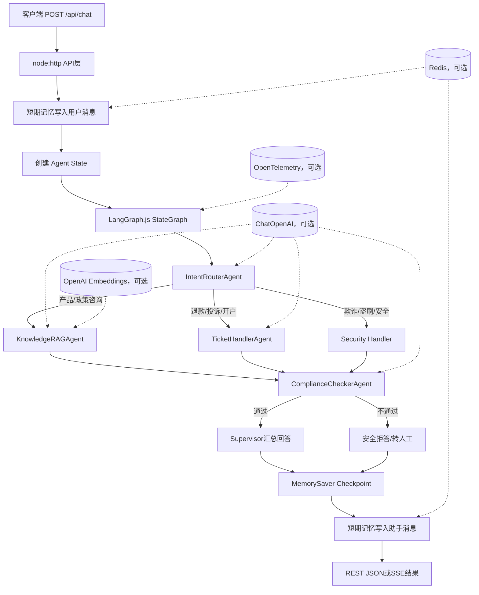

# Node.js Agent项目学习路线

这份路线面向第一次系统学习Agent工程的开发者。建议严格按顺序阅读和动手，不要一开始就接真实LLM或改编排框架。

## 1. 先建立全局模型

一次聊天请求的真实执行流程如下：



记住一句话：**API负责接请求，State负责传数据，Supervisor负责定流程，专业Agent负责处理，Compliance负责最后把关，Memory和Tracing负责系统能力。**

## 2. 从入门到精通的顺序

```mermaid
flowchart LR
    A[1 启动与调用API] --> B[2 理解State]
    B --> C[3 理解意图路由]
    C --> D[4 理解Supervisor图]
    D --> E[5 学习RAG与工单]
    E --> F[6 学习两阶段合规]
    F --> G[7 学习三层记忆]
    G --> H[8 学习MCP工具]
    H --> I[9 学习Tracing]
    I --> J[10 测试与故障降级]
    J --> K[11 接入真实基础设施]
    K --> L[12 独立扩展新Agent]
```



## 3. 十二步实践课程

### 第1步：启动服务并观察输入输出

阅读：`node-impl/README.md`、`node-impl/src/main.js`、`node-impl/src/api/server.js`。

```bash
cd node-impl
npm install
npm start
```

新开终端执行：

```bash
curl http://localhost:8100/health

curl -X POST http://localhost:8100/api/chat \
  -H 'Content-Type: application/json' \
  -d '{"user_id":"student","session_id":"lesson-1","message":"理财产品的投资期限是多久？"}'
```

完成标准：能解释请求中的`user_id`、`session_id`、`message`以及响应中的`intent`、`compliance_passed`。

### 第2步：理解共享State

阅读：`node-impl/src/agents/state.js`。

重点理解：

- `StateSchema`为什么是所有节点的数据契约。
- `MessagesValue`如何追加用户和助手消息。
- `sub_results`如何充当Agent之间的共享黑板。
- 为什么一次请求必须拥有独立State。

练习：给State增加一个`request_id`字段，并让最终响应携带它。

### 第3步：理解意图路由

阅读：`node-impl/src/agents/intent-router.js`。

先观察无Key时的关键词规则，再理解配置LLM后的Zod结构化输出。分别发送产品咨询、退款申请、账户盗刷三类消息，确认它们进入不同分支。

练习：增加“物流查询”关键词，并设计它应该进入知识Agent还是独立订单Agent。

### 第4步：掌握LangGraph Supervisor

阅读：`node-impl/src/agents/supervisor.js`。

按顺序找到：节点注册、条件边、固定合规汇聚边、`MemorySaver`、`thread_id`、最终合成。画出一条知识咨询和一条退款请求的实际节点序列。

练习：调用`getStateHistory(sessionId)`，查看一次请求产生的多个Checkpoint。

### 第5步：掌握两个业务Agent

阅读：

- `node-impl/src/agents/knowledge-rag.js`
- `node-impl/src/agents/ticket-handler.js`
- `node-impl/src/memory/long-term.js`

RAG链路是Query改写 → Top-5召回 → Top-3重排 → 基于文档生成；无模型时降级为中英文关键词检索和模板回答。工单Agent支持创建、编号查询、状态更新和按用户查询。

练习：新增一篇知识文档，再提交工单并完成“创建 → 查询 → resolved更新”。

### 第6步：理解两阶段合规

阅读：`node-impl/src/agents/compliance-checker.js`。

第一阶段用规则识别金融违禁词与PII，第二阶段在配置LLM后检查隐性承诺、越权和歧视内容。重点理解为什么合规节点必须位于所有业务分支的统一出口。

练习：分别测试手机号、银行卡号、“稳赚不赔”和正常产品说明。

### 第7步：理解三层记忆

阅读：`node-impl/src/memory/`。

| 层次 | 当前职责 | 当前存储 |
| --- | --- | --- |
| 工作记忆 | 当前会话路由上下文和状态变更 | 进程内Map |
| 短期记忆 | 最近N条用户/助手消息与TTL | Redis，失败回退Map |
| 长期记忆 | 知识文档召回 | Embedding内存向量，失败回退关键词 |

练习：连续使用同一个`session_id`请求两次，然后访问`GET /api/history/lesson-1`。

### 第8步：理解MCP工具层

阅读：`node-impl/src/mcp/server.js`。

依次理解`register()`、`listTools()`、参数校验、`callTool()`、JSON-RPC `tools/list`和`tools/call`。注意Agent编排与MCP工具注册是两个边界清晰的模块。

练习：通过`POST /mcp`调用`risk_check`，再新增一个只读的`user_profile`工具。

### 第9步：理解可观测性

阅读：`node-impl/src/tracing/tracer.js`。

理解`startActiveSpan()`、异常记录、Span状态、耗时属性、OTLP Exporter与本地聚合指标。访问`GET /api/metrics`查看各Agent调用次数和平均耗时。

练习：让一个Mock Agent抛错，确认错误率增加且异常继续向上抛出。

### 第10步：用测试理解系统契约

阅读并运行：`node-impl/test/application.test.js`。

```bash
npm test
```

八条测试覆盖HTTP健康检查、LangGraph Checkpoint、知识检索、工单流转、MCP、PII、Mock LLM全链路与Embedding排序。先逐条读懂，再尝试故意破坏一处实现，观察哪个测试最先失败。

### 第11步：接入真实外部能力

按风险从低到高依次接入：

1. Redis：确认多个服务实例共享会话历史。
2. OTLP Collector/Jaeger：确认Supervisor与Agent父子Span。
3. OpenAI兼容模型：确认结构化路由、RAG生成和LLM合规。
4. 持久化Checkpointer和向量数据库：验证重启与多实例恢复。

不要同时接入所有依赖，否则出现问题时难以判断是模型、网络、Schema还是存储导致。

### 第12步：独立完成一个新Agent

建议实现`OrderQueryAgent`：

1. 定义订单意图与结构化结果。
2. 复用MCP `order_query`工具。
3. 在Supervisor增加节点和条件边。
4. 确保结果经过Compliance。
5. 为成功、参数错误、工具异常和合规拦截添加测试。
6. 为该Agent添加Span属性和文档。

能独立完成这一步，说明你已从“会运行项目”进入“能设计和扩展Agent系统”的阶段。

## 4. 精通标准

当你能不看答案解释并完成下面事项，就可以认为掌握了这个项目：

- 从HTTP请求一路追踪到LangGraph最终响应。
- 解释Checkpoint、聊天历史和工作记忆的差别。
- 解释LLM不可用时四个Agent如何降级。
- 在不绕过合规节点的前提下增加新Agent。
- 判断一个任务应该做成Agent、普通函数还是MCP工具。
- 用测试复现路由、检索、合规、Redis或模型故障。
- 将MemorySaver、内存向量和内存工单替换为生产存储。
- 从Trace和指标定位慢节点或失败节点。

## 5. 推荐节奏

- 第1天：第1—4步，理解主链路。
- 第2天：第5—7步，理解业务Agent和记忆。
- 第3天：第8—10步，理解工具、追踪和测试。
- 第4—5天：第11步，接入Redis、Jaeger和真实模型。
- 第6—7天：第12步，独立实现订单Agent并补齐测试和文档。

学习时始终遵循“先运行 → 再观察 → 再读代码 → 小改动 → 写测试 → 最后接真实基础设施”的循环。
